# Comandos SQL para CRUD - Referência

## INSERT

### Tabela cursos
```sql
INSERT INTO cursos (titulo, carga_horaria) 
VALUES(
    'Front-End', 
    40
),
(
    'Back-End', 
    80
),
(
    'UX/UI Design', 
    30
),
(
    'Figma', 
    10
),
(
    'Redes de Computadores', 
    100
);
```

### Tabela professores
```sql
INSERT INTO professores (nome, area_de_atuacao, curso_id) VALUES(
    'Jon Oliva',
    'infra',
    5
),
(
    'Lemmy Kilmister',
    'design',
    4
),
(
    'Neil Peart',
    'design',
    3
),
(
    'Ozzy Osbourne',
    'desenvolvimento',
    2
),
(
    'David Gilmour',
    'desenvolvimento',
    1
);
```

### Tabela de cursos relacionada a Tabela professores
```sql
UPDATE cursos SET professor_id = 1 WHERE id = 5;
UPDATE cursos SET professor_id = 2 WHERE id = 4;
UPDATE cursos SET professor_id = 3 WHERE id = 3;
UPDATE cursos SET professor_id = 4 WHERE id = 2;
UPDATE cursos SET professor_id = 5 WHERE id = 1;
```


### Tabela alunos
```sql
INSERT INTO alunos (nome, data_nascimento, primeira_nota, segunda_nota, curso_id) 
VALUES(
    'Marcello Sakalauskas Antunes',
    '1973-10-01',
    10,
    8,
    5
),
(
    'Geraldo Antunes',
    '1936-03-27',
    10,
    9,
    4
),
(
    'Guilherme M. Sakalauskas',
    '1998-04-03',
    5,
    7,
    4
),
(
    'Cláudia M. Sakalauskas',
    '1978-03-05',
    2,
    4,
    3
),
(
    'Giovanna M. Sakalauskas',
    '2008-03-07',
    7,
    10,
    1
),
(
    'Olga Sakalauskas',
    '1940-06-06',
    10,
    10,
    2
),
(
    'Adrianne Sakalauskas',
    '1975-12-20',
    10,
    9,
    5
),
(
    'Isabella Soares',
    '2000-09-21',
    9,
    7,
    5
),
(
    'Alice Monteiro',
    '1957-03-26',
    4,
    10,
    2
),
(
    'Romeu Antunes',
    '1962-02-06',
    7,
    10,
    4
);

```


# Exercício
## Etapa 3
```sql
-- 1) Faça uma consulta que mostre os alunos que nasceram antes do ano 2009.
SELECT nome FROM alunos WHERE YEAR(data_nascimento) < 2009;
```
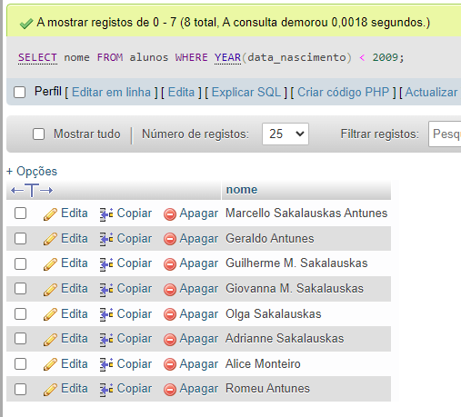


```sql
-- 2) Faça uma consulta que calcule a média das notas de cada aluno e as 
mostre com duas casas decimais.
SELECT alunos.nome AS "Nome Aluno",
    cursos.titulo AS "Nome Curso",
    ROUND(((alunos.primeira_nota + alunos.segunda_nota) / 2),2) AS "Média"
FROM alunos INNER JOIN cursos
ON alunos.curso_id = cursos.id;
```
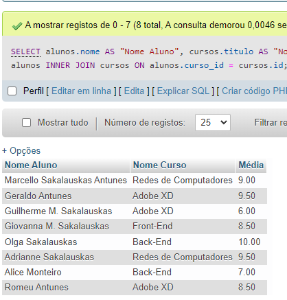


```sql
-- 3) Faça uma consulta que calcule o limite de faltas de cada curso de acordo com a carga horária. Considere o limite como 25% da carga horária. Classifique em ordem crescente pelo título do curso.
SELECT cursos.titulo AS "Curso",
    cursos.carga_horaria AS "Carga Horária",
    (cursos.carga_horaria * .25) AS "Limite Faltas (Horas)"
FROM cursos
ORDER BY cursos.titulo
```
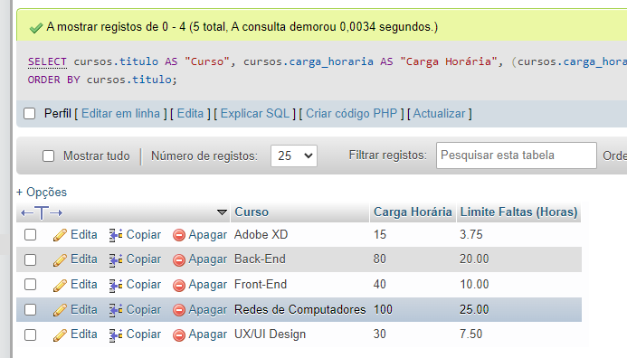


```sql
-- 4) Faça uma consulta que mostre os nomes somente dos professores da área de desenvolvimento.
SELECT professores.nome AS "Professores"
FROM professores
WHERE area_de_atuacao LIKE '%desenvolvimento%';
```
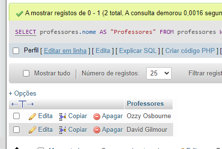


```sql
-- 5) Faça uma consulta que mostre a quantidade de professores por área de desenvolvimento.
SELECT professores.area_de_atuacao AS "Área de Atuação",
    COUNT(DISTINCT professores.curso_id) AS "Total Professores"
FROM professores
GROUP BY professores.area_de_atuacao;
```
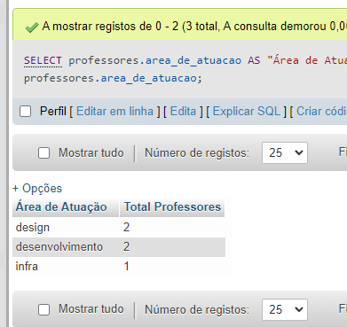


```sql
-- 6) Faça uma consulta que mostre o nome dos alunos, o título e a carga horária dos cursos que fazem.
SELECT alunos.nome AS "Nome Aluno",
    cursos.titulo AS "Curso",
    cursos.carga_horaria AS "Carga Horária"
FROM alunos INNER JOIN cursos
ON alunos.curso_id = cursos.id;
```
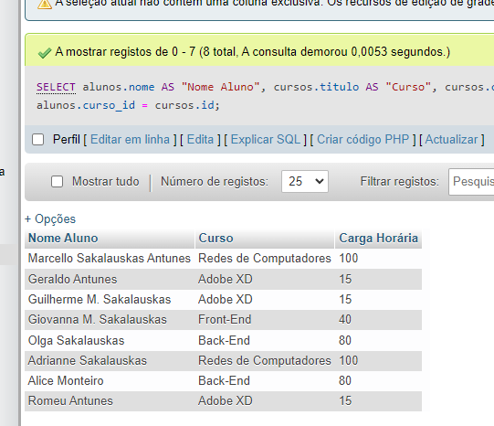


```sql
-- 7) Faça uma consulta que mostre o nome dos professores e o título do curso que lecionam. Classifique pelo nome do professor.
SELECT professores.nome AS "Professor",
    cursos.titulo AS "Título Curso"
FROM professores INNER JOIN cursos
ON professores.curso_id = cursos.id
ORDER BY professores.nome ASC;
```
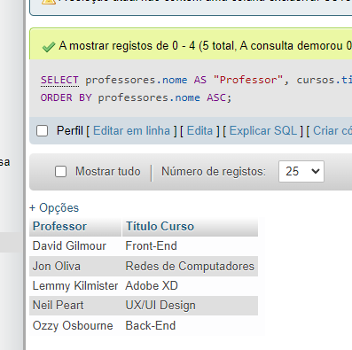


```sql
-- 8) Faça uma consulta que mostre o nome dos alunos, o título dos cursos que fazem, e o professor de cada curso.
SELECT alunos.nome AS "Aluno",
    cursos.titulo AS "Curso",
    professores.nome AS "Professor"
FROM alunos INNER JOIN cursos INNER JOIN professores
ON alunos.curso_id = cursos.id AND professores.curso_id = cursos.id;
```
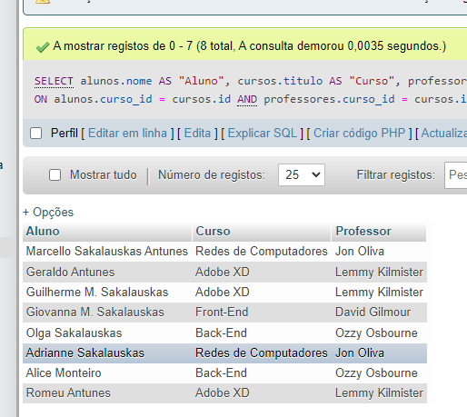


```sql
-- 9) Faça uma consulta que mostre a quantidade de alunos que cada curso possui. Classifique os resultados em ordem descrecente de acordo com a quantidade de alunos.
SELECT COUNT(alunos.curso_id) AS "Qtde Alunos",
    cursos.titulo AS "Curso"
FROM alunos INNER JOIN cursos
ON alunos.curso_id = cursos.id
GROUP BY alunos.curso_id
ORDER BY COUNT(alunos.curso_id) DESC;
```
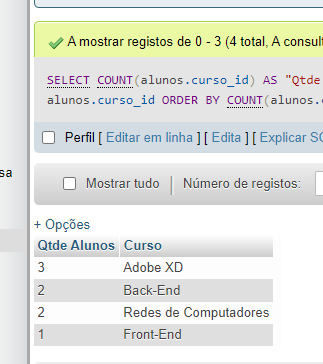


```sql
-- 10) Faça uma consulta que mostre o nome dos alunos, suas notas, médias, e o título dos cursos que fazem. Devem ser considerados somente os alunos de Front-End e Back-End. Mostre classificados pelo nome do aluno.
SELECT alunos.nome AS "Nome Aluno",
    alunos.primeira_nota AS "Nota B1",
    alunos.segunda_nota AS "Nota B2",
    ROUND(((alunos.primeira_nota + alunos.segunda_nota) / 2),2) AS Media,
    cursos.titulo AS "Nome Curso"
FROM alunos INNER JOIN cursos
ON alunos.curso_id = cursos.id
WHERE cursos.titulo LIKE '%Front-End%' OR cursos.titulo LIKE '%bACK-End%'
GROUP BY alunos.nome
ORDER BY alunos.nome;
```
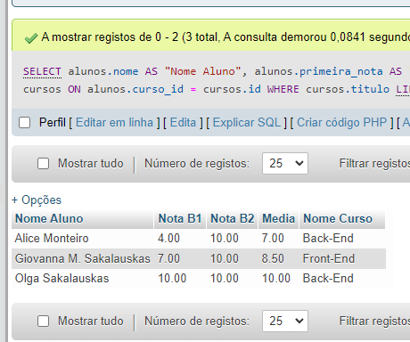


```sql
-- 11) Faça uma consulta que altere o nome do curso de Figma para Adobe XD e sua carga horária de 10 para 15.
UPDATE cursos SET titulo = 'Adobe XD', carga_horaria = 15
WHERE id = 4;
```
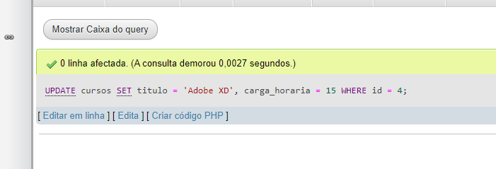


```sql
-- 12) Faça uma consulta que exclua um aluno do curso de Redes de Computadores e um aluno do curso de UX/UI.
DELETE FROM alunos WHERE id = 4 OR id = 8;
```
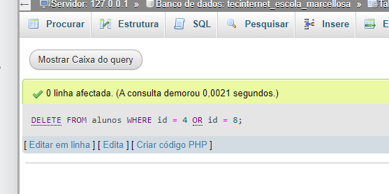


```sql
-- 13) Faça uma consulta que mostre a lista de alunos atualizada e o título dos cursos que fazem, classificados pelo nome do aluno.
SELECT alunos.nome AS "Nome Aluno",
    cursos.titulo AS "Nome Curso"
FROM alunos INNER JOIN cursos
ON alunos.curso_id = cursos.id
ORDER BY alunos.nome;
```
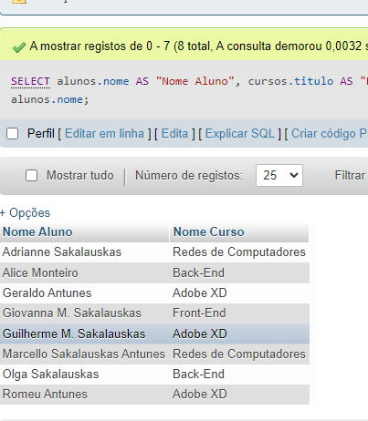


## Desafio
```sql
-- 1) Criar uma consulta que calcule a idade do aluno
SELECT alunos.nome AS "Nome Aluno",
    (2022 - (YEAR(data_nascimento) )) AS "Idade"
FROM alunos;
```
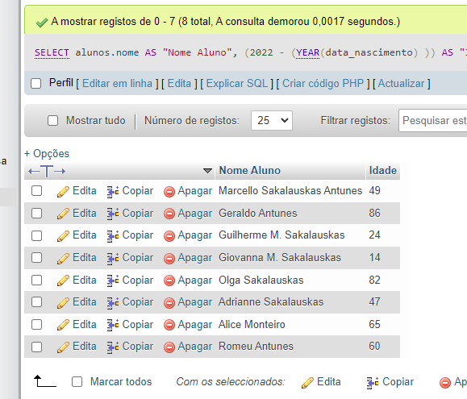


```sql
-- 2) Criar uma consulta que calcule a média das notas de cada aluno e mostre somente os alunos que tiveram a média **maior ou igual a 7**.
SELECT alunos.nome AS "Nome Aluno",
    ROUND(((alunos.primeira_nota + alunos.segunda_nota) / 2),2) AS Media
FROM alunos
WHERE ((alunos.primeira_nota + alunos.segunda_nota) / 2) >= 7;
```
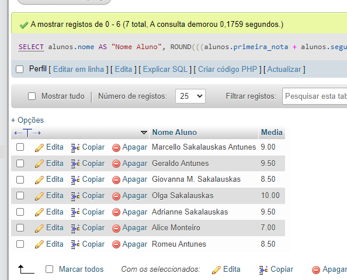


```sql
-- 3) Criar uma consulta que calcule a média das notas de cada aluno e mostre somente os alunos que tiveram a média **menor que 7**
SELECT alunos.nome AS "Nome Aluno",
    ROUND(((alunos.primeira_nota + alunos.segunda_nota) / 2),2) AS Media
FROM alunos
WHERE ((alunos.primeira_nota + alunos.segunda_nota) / 2) < 7;
```


```sql
-- 4) Criar uma consulta que mostre a quantidade de alunos com média **maior ou igual a 7**.
SELECT COUNT(((alunos.primeira_nota + alunos.segunda_nota) / 2)) AS "Qtde Média >= 7"
FROM alunos
WHERE ((alunos.primeira_nota + alunos.segunda_nota) / 2) >= 7;
```
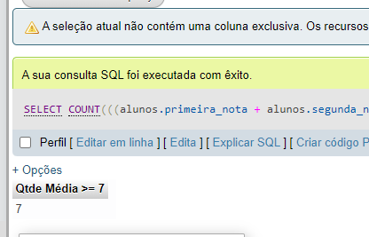


